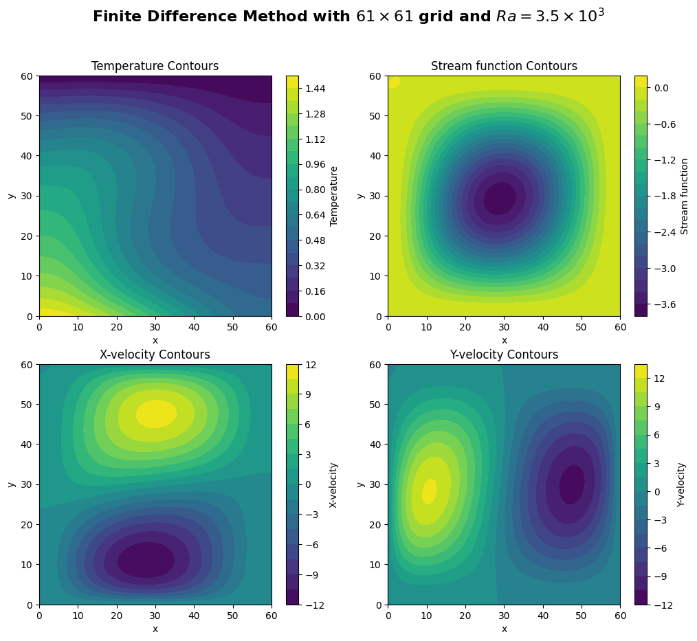
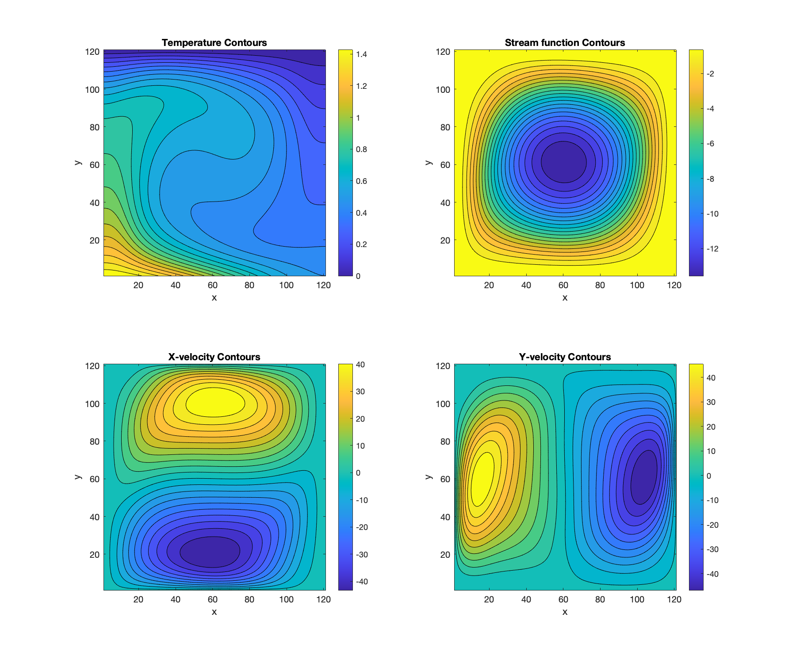

# Natural Convection in a Square Cavity - Finite Difference Method Solver

This project implements a **Finite Difference Method (FDM)** solver for simulating natural convection in a square cavity using the **vorticity-streamfunction formulation** of the non-dimensional Navier-Stokes equations.

## Table of Contents
- [Project Description](#project-description)
- [Mathematical Formulation](#mathematical-formulation)
- [Numerical Methods](#numerical-methods)
- [Results](#results)


## Project Description
The solver investigates natural convection phenomena in a square cavity with:
- **Pr = 0.7** (Prandtl number)
- **Ra = 3.5×10³** and **Ra = 2.5×10⁴** (Rayleigh numbers)
- Mesh sizes: 61×61 and 121×121

Key features:
- Vorticity-streamfunction formulation to eliminate pressure
- Explicit Euler time integration for vorticity and temperature
- Point Jacobi relaxation for streamfunction
- Second-order accurate boundary conditions

## Mathematical Formulation
The solver uses the non-dimensional vorticity-streamfunction formulation:

### Governing Equations
1. **Vorticity Transport Equation**:
   $$\frac{\partial \omega}{\partial t} + u \frac{\partial \omega}{\partial x} + v \frac{\partial \omega}{\partial y} = Pr \left( \frac{\partial^2 \omega}{\partial x^2} + \frac{\partial^2 \omega}{\partial y^2} \right) - Pr \cdot Ra \cdot \frac{\partial T}{\partial x}$$

2. **Poisson Equation**:
   $$\nabla^2 \psi = \omega$$

3. **Heat Equation**:
   $$\frac{\partial T}{\partial t} + u \frac{\partial T}{\partial x} + v \frac{\partial T}{\partial y} = \frac{\partial^2 T}{\partial x^2} + \frac{\partial^2 T}{\partial y^2}$$

## Numerical Methods
- **Spatial Discretization**: Central differencing (2nd-order accurate)
- **Temporal Discretization**: Explicit Euler method
- **Boundary Conditions**:
  - 2nd-order Taylor expansion for vorticity
  - One-sided differences for streamfunction
  - Dirichlet/Neumann conditions for temperature
- **Velocity Computation**: Derived from streamfunction ($u = \partial\psi/\partial y$, $v = -\partial\psi/\partial x$)

## Results
### Case 1: Ra = 3.5×10³ (61×61 mesh)
| Parameter          | Value               | Location         |
|--------------------|---------------------|------------------|
| Max u-velocity     | 11.65 m/s           | y = 0.1833       |
| Max v-velocity     | 12.17 m/s           | x = 0.1833       |
| Avg Nusselt (y=0)  | 1.909               | -                |



### Case 2: Ra = 2.5×10⁴ (121×121 mesh)
| Parameter          | Value               | Location         |
|--------------------|---------------------|------------------|
| Max u-velocity     | 44.28 m/s           | y = 0.8333       |
| Max v-velocity     | 50.08 m/s           | x = 0.1250       |
| Avg Nusselt (y=0)  | 3.391               | -                |



## Getting Started
### Prerequisites
- Python 3.8+ with NumPy, Matplotlib
- MATLAB R2021a+

### Running the Code
1. Clone the repository:
   ```bash
   git clone https://github.com/theopenguino99/ME5302-Assignment-2.git
   cd ME5302-Assignment-2